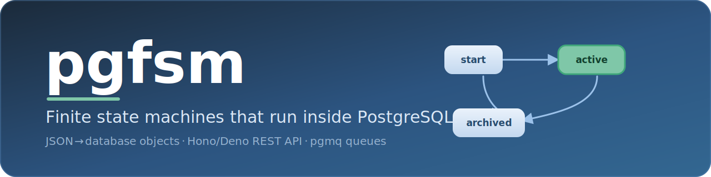

<p align="center">
  
</p>

<h1 align="center">FSM Framework</h1>

<p align="center">
  <a href="https://discord.gg/FPNfaAbpq9"></a>
  <a href="./CONTRIBUTING.md"></a>
  <a href="./LICENSE"></a>
  <a href="https://api.reuse.software/info/github.com/pgfsm/fsm"></a>
</p>

A framework for running versioned finite state machines inside PostgreSQL, with a Hono/Deno REST API.

## What it is

FSMs are defined as JSON, compiled into database objects, and executed entirely inside PostgreSQL. The REST API creates instances and enqueues events; workers poll queues and drive transitions; PostgreSQL owns the state at every step.

```
Client
  │
  ▼
REST API (Hono/Deno)          ← create instances, send events
  │
  ▼
PostgreSQL (fsm_core schema)  ← FSM definitions, instance state, event queues (pgmq)
  ▲
  │
Workers (Deno)                ← poll queues, run transitions, archive results
```

Each FSM instance owns a dedicated pgmq queue. Events are messages in that queue. Workers process one message at a time, run all triggered transitions (a macrostep), and write the new state back — atomically, inside a single PG function call.

## Quick start

```bash
# 1. Start Supabase (PostgreSQL + pgmq + ltree)
cd packages/database-src && npm run supabase:start

# 2. Start the API server (port 9999)
cd apps/fsm-core-ts-hono-deno && deno run --allow-all --env-file=.env --watch main.ts
```

OpenAPI docs available at `http://localhost:9999/fsm/docs`.

## Example: creditCheck

The `creditCheck` FSM (in `apps/fsm-core-example/fsm/creditCheck/v01/`) models a credit verification flow.

### States

```
┌─────────────────────────┐
│   Entering Information  │  ← initial
└──────────┬──────────────┘
           │ Submit
           ▼
┌─────────────────────────┐
│  Verifying Credentials  │  (invokes async actor)
└────┬──────────────┬─────┘
     │ done         │ error
     ▼              ▼
┌──────────────┐  ┌─────────────────────────┐
│ Checking     │  │   Entering Information  │  (retry)
│ Credit Scores│  └─────────────────────────┘
│ (parallel)   │
└──────────────┘
```

### Running it

```bash
BASE=http://localhost:9999/fsm

# 1. Create an instance
curl -s -X POST $BASE/fsm \
  -H "Content-Type: application/json" \
  -d '{"fsm_name": "creditCheck", "fsm_version": "v01", "fsm_context": {}}'
# → { "id": "550e8400-...", "fsm_instance_status": "active", ... }

INSTANCE_ID="550e8400-..."   # replace with the id from above

# 2. Start a worker for this instance
curl -s -X POST $BASE/fsmworker \
  -H "Content-Type: application/json" \
  -d "{\"queue\": \"$INSTANCE_ID\"}"

# 3. Send the Submit event
curl -s -X POST $BASE/fsm/send \
  -H "Content-Type: application/json" \
  -d "{\"fsm_instance_id\": \"$INSTANCE_ID\", \"event_data\": {\"type\": \"Submit\"}}"

# 4. Check state
curl -s $BASE/fsm | jq '.data[] | select(.id == "'$INSTANCE_ID'")'
```

## Project structure

```
apps/
  fsm-core-ts-hono-deno/   REST API — see apps/fsm-core-ts-hono-deno/README.md
  fsm-core-worker-ts/      Queue workers — see apps/fsm-core-worker-ts/README.md
  fsm-core-example/        Example FSM definitions — see apps/fsm-core-example/README.md
packages/
  database-src/            PostgreSQL schema + migrations — see packages/database-src/README.md
  database-src-extension/  Rust PG extension (ltree + pgmq) — see packages/database-src-extension/README.md
  fsm-compiler-ts/         FSM JSON compiler — see packages/fsm-compiler-ts/README.md
  fsm-core-db-ts/          Database access layer — see packages/fsm-core-db-ts/README.md
```

## Deeper reading

- [FSM definition format](./packages/fsm-compiler-ts/docs/fsm-definition-format.md) — how to write `fsm.json`
- [Execution model](./execution-model.md) — how an event flows from API to archive
- [PG→TS function mapping](./packages/database-src/docs/pg-ts-function-mapping.md) — PostgreSQL ↔ TypeScript reference
- [Context map](./CONTEXT-MAP.md) — domain language per package

## Community

- [Discord](https://discord.gg/FPNfaAbpq9) — chat, questions, and help
- [Contributing guide](./CONTRIBUTING.md) — how to get involved
- [Security policy](./SECURITY.md) — how to report a vulnerability
- [License](./LICENSE) — Apache-2.0
