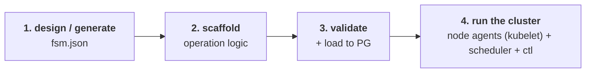

<h1 align="center">FSM Framework — Lifecycle</h1>

<p align="center">
  A framework for running versioned finite state machines inside PostgreSQL.
</p>

<p align="center">
  <a href="./CONTRIBUTING.md"></a>
  <a href="./LICENSE"></a>
</p>

This document is the lifecycle spec for an FSM — **design/generate** →
**scaffold** → **validate** → **run the cluster**.



_Every step reads and writes through PostgreSQL as the source of truth._

---

## 1. Design or generate fsm.json

Sample fsm json

```jsonc
// fsm.json excerpt — one state using both kinds of operation logic
{
  "states": {
    "verifyingCredentials": {
      "entry": [{ "type": "logAttempt" }], // action — sync
      "invoke": [
        {
          // actor — async, driven by asyncOperationWorkerlet
          "type": "xstate.invoke",
          "id": "creditBureauCheck",
          "src": "checkBureau", // exported fn in <lang>/actors/checkBureau/checkBureau.<ext>
          "fsmType": "promise", // promise | sharedPromise | sharedFsm | fsm
          "fsmVersion": "1",
          "fsmLanguage": "typescript" // the routing key for the polyglot model // typescript | python | rust | go | llm  (🔭 reserved)
        }
      ],
      "on": {
        "xstate.done.actor.creditBureauCheck": {
          "target": "checkingCreditScores",
          "guard": { "type": "isEligible" } // guard — sync
        }
      }
    }
  }
}
```

JSON Schema Reference:
[`packages/database-src/fsm.machine.schema.v3.json`](./packages/database-src/fsm.machine.schema.v3.json)

Format guide:
[`fsm-definition-format.md`](./packages/fsm-compiler-ts/docs/reference/fsm-definition-format.md).

Example :
[apps/fsm-core-example/fsm/creditCheck/v01/](./apps/fsm-core-example/fsm/creditCheck/v01/)

| Info    | Generate From an existing XState machine                                                                                                                                                                                                                                                                                                                                                                                    | Design From scratch                                                                                                                                                                   |
| ------- | --------------------------------------------------------------------------------------------------------------------------------------------------------------------------------------------------------------------------------------------------------------------------------------------------------------------------------------------------------------------------------------------------------------------------- | ------------------------------------------------------------------------------------------------------------------------------------------------------------------------------------- |
| Source  | An existing XState 5 `machine.ts`                                                                                                                                                                                                                                                                                                                                                                                           | No XState source — hand-author `fsm.json` directly against the schema                                                                                                                 |
| How     | Point the compiler at `machine.ts`; it emits `fsm.json` + `xstate-fsm.json`                                                                                                                                                                                                                                                                                                                                                 | Author states, transitions, and `invoke` objects by hand, then validate against the schema with any JSON Schema validator, e.g. [`ajv-cli`](https://github.com/ajv-validator/ajv-cli) |
| Command | `deno run --allow-all packages/fsm-compiler-ts/src/cli/index.ts -c generate -f apps/fsm-core-example/fsm/creditCheck/v01/machine.ts`                                                                                                                                                                                                                                                                                        | `npx ajv-cli validate -s packages/database-src/fsm.machine.schema.v3.json -d apps/fsm-core-example/fsm/creditCheck/v01/fsm.json`                                                      |
| Steps   | 1. Export raw XState JSON → write `xstate-fsm.json`<br>2. Strip null entries from action arrays<br>3. Normalize string actions to `{ type }` objects<br>4. Set `actionName` from `delay` on raise/cancel actions<br>5. Fill in missing `fsmType`/`fsmVersion` on `invoke` (actor) entries<br>6. Write `fsm.json`<br>7. _(optional, `--show-recommendation`)_ validate `fsm.json` against the schema and log recommendations | None — you author `fsm.json` by hand, then run the `ajv-cli` command yourself                                                                                                         |
| Output  | `fsm.json` + `xstate-fsm.json`                                                                                                                                                                                                                                                                                                                                                                                              | `fsm.json`                                                                                                                                                                            |

---

## 2. Scaffold FSM operation

From a compiled `fsm.json`, generate **base (stub) code** for the two families
of operation logic a machine can reference:

1. **Async operation logic** — `actors`, via `invoke` objects
2. **Sync operation logic** — `actions`, `guards`, `delays`

Both are driven by the same compiler CLI; they differ in command, language
routing, and where the resulting code runs.

| Info                | Async Operation                                                                                                                                                                 | Sync Operation                                                                                                                                                           |
| ------------------- | ------------------------------------------------------------------------------------------------------------------------------------------------------------------------------- | ------------------------------------------------------------------------------------------------------------------------------------------------------------------------ |
| FSM component       | `actors` (the `invoke` objects on a state)                                                                                                                                      | `actions`, `guards`, `delays`                                                                                                                                            |
| PRD                 | [PRD-002](./packages/fsm-compiler-ts/docs/prd/prd-002-scaffold-async-operation-logic.md)                                                                                        | [PRD-003](./packages/fsm-compiler-ts/docs/prd/prd-003-scaffold-sync-operation-logic.md)                                                                                  |
| Execution model     | Long-running; each runs in its own queue and process, driven by the `asyncOperationWorkerlet`; reports back via `xstate.done.actor.<id>` / `xstate.error.actor.<id>` events     | Pure/inline; runs inside a single macrostep of the `fsmlet` — no separate queue or process                                                                               |
| CLI command         | `generate-async-logic`                                                                                                                                                          | `generate-sync-logic`                                                                                                                                                    |
| Command             | `deno run --allow-all packages/fsm-compiler-ts/src/cli/index.ts -c generate-async-logic -f apps/fsm-core-example/fsm`                                                           | `deno run --allow-all packages/fsm-compiler-ts/src/cli/index.ts -c generate-sync-logic -f apps/fsm-core-example/fsm --lang typescript,python`                            |
| Language selection  | Per-invoke, from that invoke object's `fsmLanguage` field — a single machine can spread its actors across runtimes                                                              | Via `--lang` flag (comma-separated), applied uniformly to the whole generation run; default `typescript` only                                                            |
| Languages generated | It will generate code for all 4 languages, one invoke at a time, according to each invoke's `fsmLanguage`                                                                       | It will generate code for TS only unless `--lang` is passed with other languages                                                                                         |
| Supported languages | `typescript`, `python`, `rust`, `go` — unsupported `fsmLanguage` values are skipped with a warning                                                                              | `typescript`, `python`, `rust`, `go`                                                                                                                                     |
| File naming         | One file per invoke, in its own subfolder: `<src>/<src>.<ext>` (exports one function named after the actor `src`)                                                               | One stub per `action` / `guard` / `delay` referenced in `fsm.json`                                                                                                       |
| Output layout       | `<fsmLanguage>/actors/<src>/<src>.<ext>`                                                                                                                                        | `<lang>/actions/<index>`, `<lang>/guards/<index>`, `<lang>/delays/<index>`                                                                                               |
| Planned gaps        | Generated actor stub signature doesn't yet match the worker's `(input) => Promise<output>` calling convention; external actors are still stubbed locally rather than referenced | Action stubs are emitted as `(context, event)` and guard stubs as `(context, event)`, but the worker invokes them as `(context, params, meta)` / `(context, cond, meta)` |

See the compiler [TODO](./packages/fsm-compiler-ts/docs/todo/TODO.md) for both
planned-gap items.

### Async operation logic — example layout

```
creditCheck/v01/
  typescript/actors/checkBureau/checkBureau.ts         # fsmLanguage: "typescript"
  python/actors/checkBureau/checkBureau.py             # fsmLanguage: "python"
  rust/actors/checkBureau/checkBureau.rs               # fsmLanguage: "rust"
  go/actors/checkReportsTable/checkReportsTable.go     # fsmLanguage: "go"
```

### Sync operation logic — example layout

```
<lang>/
  actions/<index>   # side effects
  guards/<index>    # transition predicates (return boolean)
  delays/<index>    # delay durations (return ms)
```

Fill in the sync stubs, then validate exports without touching the database:

```bash
deno run --allow-all packages/fsm-compiler-ts/src/cli/index.ts \
  -c validate-sync-operation \
  -f apps/fsm-core-example/fsm \
  -w fsm
```

---

## 3. Validate operation logic

Once the stubs from section 2 are filled in, validate that each async
operation-logic module and each sync `action` / `guard` / `delay` actually
export what the machine expects. Validation and the PostgreSQL load are separate
steps: each workflow type has its own validate-only command, and a single shared
`load` command then loads `fsm.json` into PostgreSQL — this is the DB-side half
of the seam the `asyncOperationWorkerlet` and `fsmlet` (section 4) consume.

| Info                  | Async Operation                                                                                                                 | Sync Operation                                                                             |
| --------------------- | ------------------------------------------------------------------------------------------------------------------------------- | ------------------------------------------------------------------------------------------ |
| PRD                   | [PRD-004](./packages/fsm-compiler-ts/docs/prd/prd-004-validate-async-operation-logic.md)                                        | [PRD-005](./packages/fsm-compiler-ts/docs/prd/prd-005-validate-sync-operation-logic.md)    |
| What it validates     | Each async operation-logic module actually exports its named function                                                           | Every `action`, `guard`, `delay` referenced in `fsm.json` is exported with the right shape |
| Validate-only command | `validate-async-operation`                                                                                                      | `validate-sync-operation`                                                                  |
| Language scope        | `--lang` (comma-separated) restricts to a language subset; omitted = all actor languages are checked                            | Validates whatever `--lang` languages were scaffolded in section 2                         |
| Per-language check    | Each language's runtime is invoked to confirm the function is defined — not just that the file exists (see runtime table below) | Validated via `validateSyncOperationFromFolder`                                            |

### Async operation logic — runtime called per language

| Language     | Runtime called                                         |
| ------------ | ------------------------------------------------------ |
| `typescript` | `deno run src/checkers/check_fn.ts <file> <fn>`        |
| `python`     | `python3 src/checkers/check_fn.py <file> <fn>`         |
| `go`         | `go build -o binary src/checkers/check_fn.go` → binary |
| `rust`       | `rustc src/checkers/check_fn.rs` → binary, then binary |

```bash
# Validate all languages (calls each language's runtime)
deno run --allow-all packages/fsm-compiler-ts/src/cli/index.ts \
  -c validate-async-operation \
  -f apps/fsm-core-example/sharedFSM \
  -w sharedPromise

# Validate a specific language only
deno run --allow-all packages/fsm-compiler-ts/src/cli/index.ts \
  -c validate-async-operation \
  -f apps/fsm-core-example/sharedFSM \
  -w sharedPromise \
  --lang typescript
```

### Sync operation logic — validate

```bash
deno run --allow-all packages/fsm-compiler-ts/src/cli/index.ts \
  -c validate-sync-operation \
  -f apps/fsm-core-example/fsm \
  -w fsm
```

---

## 4. Start the workers

The async-operation side and the FSM side each run as a **node agent** (kubelet
equivalent) — it validates, loads its modules, and registers itself, then waits
for its companion **scheduler** (kube-scheduler equivalent, a separate
control-plane process — see [section 5](#5-start-the-schedulers)) to route
claimed work to it via `pg_notify`. The two node agents are structurally
identical; only the tables and per-language execution differ.

| Info                        | Async-Operation Worker (`asyncOperationWorkerlet`)                                                                                                                                                                                             | FSM Worker (`fsmlet`)                                                                                                                                                                                                                                                                  |
| --------------------------- | ---------------------------------------------------------------------------------------------------------------------------------------------------------------------------------------------------------------------------------------------- | -------------------------------------------------------------------------------------------------------------------------------------------------------------------------------------------------------------------------------------------------------------------------------------- |
| Drives                      | Async operation logic (`actors`) — one long-running promise-worker per actor queue                                                                                                                                                             | State machines — sync operation logic, transitions, and dispatching invokes                                                                                                                                                                                                            |
| Node-agent CLI              | `apps/fsm-core-worker-ts/src/cli/async-operation-workerlet.ts`                                                                                                                                                                                 | `apps/fsm-core-worker-ts/src/cli/fsmlet.ts`                                                                                                                                                                                                                                            |
| On startup, validates       | `validateAsyncOperationFromFoldersV2` — per invoke, routed by `fsmLanguage` (`typescript`/`python`/`go`/`rust`)                                                                                                                                | `validateSyncOperationFromFolders` — TypeScript only, workflow type hardcoded to `"fsm"`                                                                                                                                                                                               |
| Cross-checks the other side | none built in                                                                                                                                                                                                                                  | Optional `asyncOperationVerificationMode` (`checkRegistry` / `checkRegistryAndWorking`, via `checkRegistryForAsyncActors` / `checkRegistryAndWorkingForAsyncActors`) — shipped as a library option but not exposed as an `fsmlet` CLI flag; the CLI always runs with it off (`"none"`) |
| On startup, loads           | Each verified actor into `async_operation_meta` via `load_async_operation_meta_v2`                                                                                                                                                             | `fsm.json` into PostgreSQL via `loadFsmFromJson` → `load_fsm_from_json_v2`                                                                                                                                                                                                             |
| Registers itself in         | `async_operation_workerlet` table (`supported_async_operations`, `max_pid_number`)                                                                                                                                                             | `fsm_workerlet` table (`fsm_modules`, `max_concurrency`)                                                                                                                                                                                                                               |
| Listens on                  | `async_op_workerlet_work_<id>`                                                                                                                                                                                                                 | `fsm_fsmlet_work_<id>` and `fsm_worker_stop` (per-instance abort)                                                                                                                                                                                                                      |
| Claims work via             | `claim_scheduled_for_async_operation_workerlet()`                                                                                                                                                                                              | `claim_scheduled_for_fsmlet()`                                                                                                                                                                                                                                                         |
| Concurrency model           | One long-running worker per unique actor queue, bounded by `--max-concurrency` semaphore. TypeScript runs in-process (`startFSMPromiseWorker`); Python spawns a subprocess; Go/Rust actors validate but log a warning and are not yet runnable | One FSM worker per claimed instance, bounded by `--max-concurrency` semaphore                                                                                                                                                                                                          |
| Heartbeat                   | `asyncOperationWorkerletHeartbeat` every 5s (tracks `active_pid_number`), 30s fallback poll                                                                                                                                                    | `fsmletHeartbeat` every 5s (tracks `active_workers`), 30s fallback poll                                                                                                                                                                                                                |
| Graceful shutdown           | `SIGINT`/`SIGTERM` aborts active queue-workers, drains, deregisters from `async_operation_workerlet`                                                                                                                                           | `SIGINT`/`SIGTERM` aborts active workers, drains, deregisters from `fsm_workerlet`                                                                                                                                                                                                     |

### Start the async-operation worker

```bash
# Node agent — validates, loads actor metadata, registers, then waits for work
deno run --allow-all apps/fsm-core-worker-ts/src/cli/async-operation-workerlet.ts \
  -f /abs/path/to/apps/fsm-core-example/fsm \
  -l typescript,python     # runtime languages to validate/activate (required)
  -t promise                # workflow type: promise | sharedPromise (default promise)
  -m 8                      # max concurrent queue-workers (default 8)
  # -i <workerlet-id>       # stable identity (default: random UUID per startup)
  # -d <db-url>             # overrides DATABASE_URL
```

### Start the FSM worker

```bash
# Node agent — validates, loads fsm.json, registers, then waits for work
deno run --allow-all apps/fsm-core-worker-ts/src/cli/fsmlet.ts \
  -f /abs/path/to/apps/fsm-core-example/fsm \
  -m 8                     # max FSM instances driven concurrently (default 8)
  # -i <fsmlet-id>         # stable identity (default: random UUID per startup)
  # -d <db-url>            # overrides DATABASE_URL
```

Both node agents need their companion scheduler running somewhere in the cluster
to ever receive claimed work — see [section 5](#5-start-the-schedulers). See
[`CLI-USAGE.md`](./apps/fsm-core-worker-ts/docs/guides/CLI-USAGE.md) for the
full flag reference and startup sequence.

---

## 5. Start the schedulers

Each node-agent type has a companion **scheduler** — a control-plane routing
process (kube-scheduler equivalent) run once per cluster, never on a worker
node. It listens for a `pg_notify` wake-up, then loops a single PG function that
atomically claims the next pending dispatch entry, filters/scores active node
agents, assigns the winner, and notifies it — repeating until the queue is empty
or no node agent has capacity. A fallback poll catches any notification missed
after a `LISTEN` connection drop.

| Info                    | Async-Operation Scheduler                                                              | FSM Scheduler                                                                |
| ----------------------- | -------------------------------------------------------------------------------------- | ---------------------------------------------------------------------------- |
| CLI                     | `apps/fsm-core-worker-ts/src/cli/async-operation-scheduler.ts`                         | `apps/fsm-core-worker-ts/src/cli/fsmscheduler.ts`                            |
| Routes work for         | `asyncOperationWorkerlet` node agents                                                  | `fsmlet` node agents                                                         |
| Listens on              | `async_operation_scheduler_work`                                                       | `fsm_scheduler_work`                                                         |
| Dispatch table          | `async_operation_instance_and_async_operation_workerlet`                               | `fsm_dispatch_queue`                                                         |
| Scheduling function     | `async_operation_schedule_next_pending()`                                              | `schedule_next_pending()`                                                    |
| Notifies the winner via | `async_op_workerlet_work_<id>` (channel the workerlet is listening on — see section 4) | `fsm_fsmlet_work_<id>` (channel the fsmlet is listening on — see section 4)  |
| `--stale-threshold`     | Seconds before a workerlet with no heartbeat is treated as dead (default `30`)         | Seconds before a fsmlet with no heartbeat is treated as dead (default `30`)  |
| `--poll-interval`       | Fallback poll interval in ms, catches missed notifications (default `30000`)           | Fallback poll interval in ms, catches missed notifications (default `30000`) |
| Deployment              | Control plane, alongside the API server — **not** on worker nodes                      | Control plane, alongside the API server — **not** on worker nodes            |

### Start the async-operation scheduler

```bash
deno run --allow-all apps/fsm-core-worker-ts/src/cli/async-operation-scheduler.ts
  # -d <db-url>             # overrides DATABASE_URL
  # -p <poll-interval-ms>   # fallback poll interval (default 30000)
  # -s <stale-threshold-s>  # seconds before a workerlet is considered dead (default 30)
```

### Start the FSM scheduler

```bash
deno run --allow-all apps/fsm-core-worker-ts/src/cli/fsmscheduler.ts
  # -d <db-url>             # overrides DATABASE_URL
  # -p <poll-interval-ms>   # fallback poll interval (default 30000)
  # -s <stale-threshold-s>  # seconds before a fsmlet is considered dead (default 30)
```

---

## 6. Control the cluster (`ctl`)

Each dispatch model has a one-shot **control CLI** (kubectl equivalent) — unlike
the node agents and schedulers in sections 4–5, these issue a single command
against PostgreSQL and exit; they don't validate, register, or listen for work.

| Info                  | `fsmctl`                                                                                                           | `async-operation-ctl`                                                                                                                                       |
| --------------------- | ------------------------------------------------------------------------------------------------------------------ | ----------------------------------------------------------------------------------------------------------------------------------------------------------- |
| Controls              | FSM instances — the dispatch-queue model driven by the `fsmscheduler`/`fsmlet` pair                                | Async-operation instances — the dispatch tables driven by the async-operation scheduler/workerlet pair                                                      |
| CLI                   | `apps/fsm-core-worker-ts/src/cli/fsmctl.ts`                                                                        | `apps/fsm-core-worker-ts/src/cli/async-operation-ctl.ts`                                                                                                    |
| Commands              | `create`, `resume`, `send`, `stop`                                                                                 | `list-instances`, `list-meta`, `dispatch`                                                                                                                   |
| `create` / `dispatch` | Creates a new FSM instance, its pgmq queue, sends `initialTransition_event`, and enqueues to `fsm_dispatch_queue`  | Creates a new async-operation instance and calls `createAsyncOperationInstanceAndNotifyAsyncOperationSchedulerWork` to notify the async-operation scheduler |
| `resume`              | Re-enqueues an existing FSM instance to the `fsmscheduler` via `resumeEventForFsmWorker`                           | — (no equivalent)                                                                                                                                           |
| `send`                | Sends an event to a running FSM instance via `sendEventToFsmQueueWithEventLogs`                                    | — (no equivalent)                                                                                                                                           |
| `stop`                | Sends a stop signal to a running `fsmlet` worker via `pg_notify` (`stopFSMWorker`)                                 | — (no equivalent)                                                                                                                                           |
| `list-instances`      | — (no equivalent)                                                                                                  | Lists `async_operation_instance_and_async_operation_workerlet` rows via `listAsyncOperationInstances`                                                       |
| `list-meta`           | — (no equivalent)                                                                                                  | Lists `async_operation_meta` rows (the actor registry) via `listAsyncOperationMeta`                                                                         |
| Required flags        | `-c/--command`, plus per-command: `create` needs `-n/-v`; `resume`/`send`/`stop` need `-q`; `send` also needs `-e` | `-c/--command`, plus for `dispatch`: `-n/-v/-t`, `--parent-fsm-name`, `--parent-fsm-version`, `-l`                                                          |
| Depends on            | `fsmscheduler` + `fsmlet` running to pick up the dispatched/resumed/sent work                                      | async-operation scheduler + `asyncOperationWorkerlet` running to pick up dispatched work                                                                    |

```bash
# fsmctl
deno run --allow-all apps/fsm-core-worker-ts/src/cli/fsmctl.ts -c create -n creditCheck -v 1
deno run --allow-all apps/fsm-core-worker-ts/src/cli/fsmctl.ts -c resume -q <instance-uuid>
deno run --allow-all apps/fsm-core-worker-ts/src/cli/fsmctl.ts -c send -q <instance-uuid> -e APPROVE
deno run --allow-all apps/fsm-core-worker-ts/src/cli/fsmctl.ts -c stop -q <instance-uuid>

# async-operation-ctl
deno run --allow-all apps/fsm-core-worker-ts/src/cli/async-operation-ctl.ts -c list-instances
deno run --allow-all apps/fsm-core-worker-ts/src/cli/async-operation-ctl.ts -c list-meta
deno run --allow-all apps/fsm-core-worker-ts/src/cli/async-operation-ctl.ts -c dispatch \
  -n checkBureau -v 1 -t promise \
  --parent-fsm-name creditCheck --parent-fsm-version 1 \
  -l typescript
```

See [`CLI-USAGE.md`](./apps/fsm-core-worker-ts/docs/guides/CLI-USAGE.md) for the
full flag reference.

---

## Appendix: Maps to today's code

| Design term (this spec)                     | Today's implementation                                                                                                                                                                                | Status                                                          |
| ------------------------------------------- | ----------------------------------------------------------------------------------------------------------------------------------------------------------------------------------------------------- | --------------------------------------------------------------- |
| `asyncOperationWorkerlet`                   | `apps/fsm-core-worker-ts/src/asyncOperationWorkerlet/asyncOperationWorkerlet.ts`, CLI `async-operation-workerlet.ts`                                                                                  | ✅ Shipped                                                      |
| `async_operation_meta` (actor registry)     | `async_operation_meta` table, loaded via `loadAsyncOperation` → `load_async_operation_meta_v2`                                                                                                        | ✅ Shipped                                                      |
| `async_operation_workerlet` (node registry) | `async_operation_workerlet` table — `registerAsyncOperationWorkerlet` / `asyncOperationWorkerletHeartbeat` / `deregisterAsyncOperationWorkerlet`                                                      | ✅ Shipped                                                      |
| `lang` arg / `fsmLanguage` routing          | `generate-sync-logic --lang`; `generate-async-logic` (by `fsmLanguage`); `validate-async-operation --lang`; `async-operation-workerlet -l`; ts/python/rust/go                                         | ✅ Shipped (scaffold/validate) — 🔭 Planned (Go/Rust execution) |
| async op scaffolding (`actors/`)            | `generate-async-logic` command (`generate-async-operation-logic.ts`)                                                                                                                                  | ✅ Shipped                                                      |
| sync op scaffolding (actions/…)             | `generate-sync-logic --lang` command (`generate-sync-operation-logic.ts`)                                                                                                                             | ✅ Shipped                                                      |
| validate `fsm.json` + operation logic       | `validate-sync-operation-logic.ts`, `validate-async-operation-logic-v2.ts`                                                                                                                            | ✅ Shipped                                                      |
| load `fsm.json`                             | `load-fsm-json.ts` (`loadFsmJSONFromFolders`); `loadFsmFromJson` → `load_fsm_from_json_v2`                                                                                                            | ✅ Shipped                                                      |
| `fsmlet`, `registerFsmlet`, loop            | `apps/fsm-core-worker-ts/src/fsmlet/fsmlet.ts`, `packages/fsm-core-db-ts/src/fsm-workerlet.ts` (`fsm_workerlet` table)                                                                                | ✅ Shipped                                                      |
| heartbeat (5s)                              | `fsmletHeartbeat` / `asyncOperationWorkerletHeartbeat` (`HEARTBEAT_INTERVAL_MS = 5_000`)                                                                                                              | ✅ Shipped                                                      |
| scheduler / dispatch (FSM)                  | `fsmscheduler.ts`, `schedule_next_pending`, `enqueue_fsm_dispatch_v2`, `fsm_dispatch_queue`                                                                                                           | ✅ Shipped                                                      |
| scheduler / dispatch (async operation)      | `async-operation-scheduler.ts`, `async_operation_schedule_next_pending`, `createAsyncOperationInstanceAndNotifyAsyncOperationSchedulerWork`, `async_operation_instance_and_async_operation_workerlet` | ✅ Shipped                                                      |
| fsmlet ↔ async-actor liveness check         | `asyncOperationVerificationMode` (`checkRegistryForAsyncActors` / `checkRegistryAndWorkingForAsyncActors`) — library option, not exposed as an `fsmlet` CLI flag                                      | ⚠️ Shipped, not wired to CLI                                    |
| `fsmctl` (control CLI)                      | `apps/fsm-core-worker-ts/src/cli/fsmctl.ts` — `create` / `resume` / `send` / `stop`                                                                                                                   | ✅ Shipped                                                      |
| `async-operation-ctl` (control CLI)         | `apps/fsm-core-worker-ts/src/cli/async-operation-ctl.ts` — `list-instances` / `list-meta` / `dispatch`                                                                                                | ✅ Shipped                                                      |

## References

- Compiler CLI —
  [`cli-usage.md`](./packages/fsm-compiler-ts/docs/guides/cli-usage.md)
- Worker CLI —
  [`CLI-USAGE.md`](./apps/fsm-core-worker-ts/docs/guides/CLI-USAGE.md)
- Execution model — [`execution-model.md`](./docs/execution-model.md)
- Worker control plane —
  [`adr-002-worker-execution-model.md`](./docs/adr/adr-002-worker-execution-model.md)
- Polyglot direction —
  [`kb-001-distributed-multilang-fsm.md`](./docs/kb/kb-001-distributed-multilang-fsm.md)
